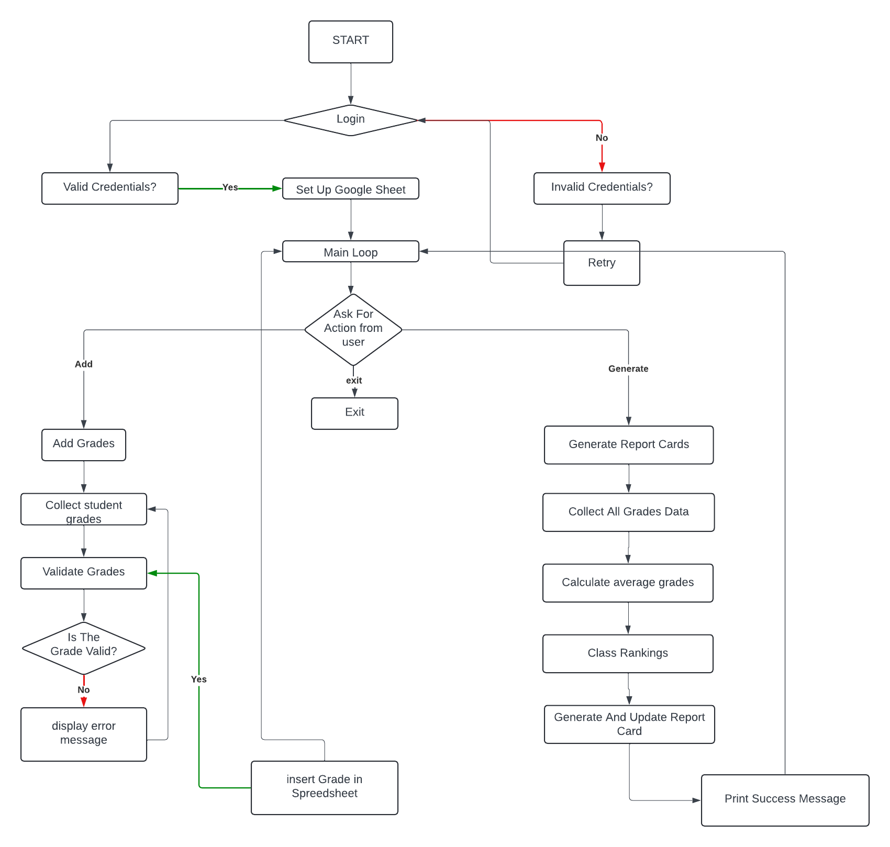

# School Report System

[This is a link to the live website]()
#### - Username- admin
#### - Password- admin123

[This is a link to the live GoogleSheet]()

## Table Of Contents
- [Introduction](#Introduction)
- [Goal](#goal)
- [Usage](#usage)
- [Design](#Design) 
  * [FlowChart/Function](#FlowChart/Function)
  * [Colorama](#colorama)
  * [User Feedback](#User-feedback)
- [Existing Features](#existing-features)
- [Future Features](#future-features)
- [UX Design](#ux-design)
    * [User Stories](#user-stories)
- [Testing](#testing)
  * [User Story Testing](#user-story-testing)
  * [Feature testing](#feature-testing)
- [Feature testing](#feature-testing)
- [Unfixed Bugs](#unfixed-bugs)  
- [Deployment](#deployment)
- [Clone A Repository](#how-to-run-the-project-locally)
- [Download A Repository](#download-the-repository) 
- [Technologies](#technologies)
- [Credits](#credits)  
- [Acknowledgements](#acknowledgements) 

## Introduction
The School Report System is a Python-based application that leverages Google Sheets to manage and analyze student grades. The system allows for secure user authentication, collection of student grades, computation of average scores, and generation of detailed report cards. This application simplifies the administrative tasks associated with student performance tracking and reporting.

## Design
### FlowChart/Function

1. **User Validation**
- Input username and password.
- Validate against stored credentials.
2. **Grade Input**
- Input student name.
- Input grades for each subject.
3. **Data Insertion**
- Insert grades into Google Sheets.
4. **Grade Collection**
- Retrieve all grades from Google Sheets.
5. **Averages Calculation**
- Calculate student and subject averages.
6. **Averages Update**
- Update Google Sheets with calculated averages.
7. **Student Ranking**
- Rank students based on average grades.
8. **Report Card Generation**
- Generate and update report cards in Google Sheets with comments.