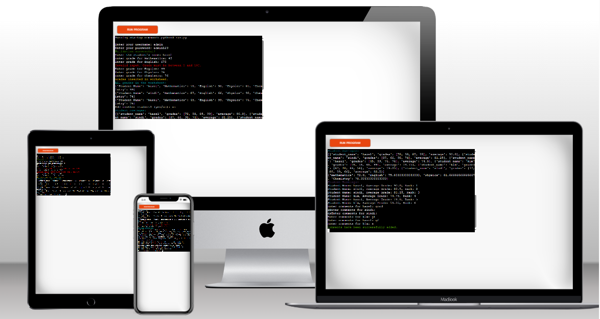
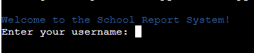
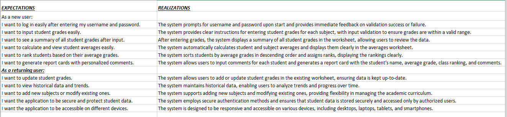
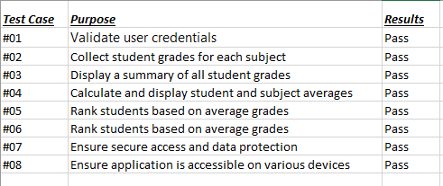

# School Report System

[This is a link to the live website](https://schoolreportsystem-7d4fc2e8318b.herokuapp.com/)

[This is a link to the live GoogleSheet](https://docs.google.com/spreadsheets/d/1MQZU3j9feQgQ2jLjEghHTpK7C_PeanNMEGgdb5cUGcM/edit?gid=0#gid=0)

## Table Of Contents
- [Introduction](#introduction)
- [Design](#design) 
  * [FlowChart/Function](#flowchartfunction)
  * [Colorama](#colorama)
  * [User Feedback](#user-feedback)
- [Application Features](#application-features)
  * [Python Logic](#python-logic)
  * [Data/APIs Used](#dataapis-used)
- [UX (User Experience)](#user-experience)
- [Accessibility](#accessibility)
- [Future Features](#future-features)
- [Testing](#testing)  
- [API Setup](#api-setup)
- [Deployment](#deployment)
- [Technologies](#technologies)
- [Code](#code)  
- [Acknowledgements](#acknowledgements) 

## Introduction
The School Report System is a Python-based application that leverages Google Sheets to manage and analyze student grades. The system allows for secure user authentication, collection of student grades, computation of average scores, and generation of detailed report cards. This application simplifies the administrative tasks associated with student performance tracking and reporting.

## Design
### FlowChart/Function

1. **User Validation**
- Input username and password.
- Validate against stored credentials.
2. **Grade Input**
- Input student name.
- Input grades for each subject.
3. **Data Insertion**
- Insert grades into Google Sheets.
4. **Grade Collection**
- Retrieve all grades from Google Sheets.
5. **Averages Calculation**
- Calculate student and subject averages.
6. **Averages Update**
- Update Google Sheets with calculated averages.
7. **Student Ranking**
- Rank students based on average grades.
8. **Report Card Generation**
- Generate and update report cards in Google Sheets with comments.

### Colorama
- The application uses the colorama library for colorizing terminal text to enhance user experience with clear visual feedback:

  * **Blue for the welcome message**

  

  * **Green for successful actions.**

  

  * **Red for errors or invalid inputs.**

  

  * **Yellow and Cyan for informational messages.**

  

  * **Magenta for highlighting student rankings.**

  

  ### User Feedback
- Successful validation: Validation successful!
- Invalid login attempt: Failed! Invalid username or password. Please try again.
- Grade entry success: Grades inserted in worksheet.
- Completion of tasks: Comments have been successfully added.

## Application Features
## Python Logic
- User Validation: Ensures secure login for administrators.
- Grade Input: Collects grades for Mathematics, English, Physics and Chemistry.
- Data Insertion: Adds grades to Google Sheets.
- Grade Collection: Retrieves and displays all stored grades.
- Averages Calculation: Calculates the average grade for each student subject.
- Averages Update: Updates Google Sheets with grade average data.
- Student Ranking: Ranks students based on average grades ascending.
- Report Card Generation: Produces report cards with personalized comments.

## Data/APIs Used
- Google Sheets API: For storing, retrieving, and updating grade data.

## User Experience
### As a first time user:

1. **Start the Process by Logging In:**
  - I want to securely log in to the system by entering my username and password.
  - I want to receive immediate feedback on the success or failure of my login attempt.

2. **Input Student Grades:**
  - I want to start the grade input process by entering a student's name.
  - I want to input grades for core subjects  such as Mathematics, English, Physics, and Chemistry.
  - I want to validate my input to ensure grades are between 0 and 100.

3. **Save and View Grades:**
  - I want to save the grades into the system (Google Sheets) by clicking a button.
  - I want to receive confirmation that grades have been successfully saved.
  - I want to view all entered grades to ensure they have been recorded correctly.

4. **Calculate and View Averages:**

  - I want the system to calculate average grades for each student and each subject automatically.
  - I want to see clear feedback on the calculated averages.

5. **Generate and View Report Cards:**
  - I want to generate report cards for each student with their average grades and class ranking.
  - I want to input personalized comments for each student.
  - I want the system to display the final report cards with all necessary details.

6. **Navigate Easily:**

  - I want clear instructions and prompts at each step of the process.
  - I want to go back to the main menu or home page to start a new task without losing previous data.

### As a Returning User:
1. **View Historical Data:**

  - I want to log in and view previously entered grades and report cards.
  - I want to see a leaderboard or ranking of students based on their average grades.

2. **Manage and Update Data:**
  - I want to update existing grades or add new grades for students.
- I want the system to recalculate averages and rankings automatically after updates.

3. **Enhanced Reporting and Analysis:**
  - I want to generate detailed reports covering various aspects such as performance trends over time.
  - I want the option to export reports as PDFs or print them directly.

4. **Receive Notifications:**
  - I want to receive email notifications when new grades are entered or reports are generated.
  - I want to be notified of any system updates or new features.

5. **Additional Features:**
  - I want to track student attendance alongside grades.
  - I want to set up automated alerts for students with grades below a certain threshold. 

## Accessibility
- Visual Feedback: Use of colorama to provide color-coded messages for better clarity and immediate understanding of system status.
-  Ensure that all inputs and interactions can be completed using the keyboard to accommodate users who may have difficulty using a mouse.
- Provide clear instructions and error messages to help users understand what is required and how to correct any mistakes.

## Future Features
- Expanded User Roles: Differentiate between who is logging in
- Grade Visualization: Graphical representation of student performance.
- Email Notifications: Send report cards to students via email.
- Parent Access: Allow parents to view their child's progress.
- Attendance Tracking: Add functionality to track student attendance alongside their grades. This could provide a more comprehensive view of student performance.

## Testing
### User story Testing
 

### Feature Testing

**No Errors Where Found**

[CI Python Linter](https://pep8ci.herokuapp.com/#)

## API Setup

1. Google Cloud Project:

  - Go to the Google Cloud Console.
  - Create a new project or select an existing one.
2.  Enable APIs:

  - Enable the Google Sheets API and Google Drive API for your project:
  - Navigate to the API Library.
  - Search for "Google Sheets API" and "Google Drive API".
  - Click on each and enable them.
3. Create a Service Account:

  - Go to the Service Accounts page.
  - Click "Create Service Account".
  - Provide a name and description for the service account.
  - Click "Create and Continue".
  - Grant Roles to the Service Account:

4. Assign the role of "Editor" to the service account.
  - Click "Continue" and then "Done".
5. Create and Download a Service Account Key:

  - Click on the service account you just created.
  - Go to the "Keys" tab.
  - Click "Add Key" and select "Create new key".
  - Choose JSON and download the key file. Save it as creds.json in your project directory.
6. Share Google Sheets with Service Account:

  - Open your Google Sheet.
  - Click "Share".
  - Enter the service account email (found in the creds.json file) and give it "Editor" access.

## Deployment
### Heroku

1. Sign into [Heroku](https://dashboard.heroku.com/apps)
2. On the right side click **New** and select **Create new app**
3. Create a new Heroku app with a unique name. Heroku will generate a random name if you don't specify one and select your region.
4. Click **Create app**
5. Close to the top select **Settings**, click on *Reveal Config Vars**
  - On **Key** and **Value** input fields enter PORT and Paste everything copied from the **creds.json** folder in your gitpod workspace(respectively).
6. Click **add** to create another set of KEY and VALUE.
  - In the input fields add KEY: PORT, VALUE: 8000
7. At the bottom, click **Add buildpack**, from the options select **python** and **nodejs** + **add buildpack** after selecting each.
8. Close to the top where you clicked **Settings** this time click **Deploy**, click **connect to github**.
  - search for the name of the repository you want to deploy and click **connect**
9. Click **deploy branch**

## Technologies
- Github for the source code.
- Gitpod for creating the website.
- Python
- Code Institute's Gitpod Template
- Heroku for deployment
- Google Sheets
- Code institute learnings
- Techsini to create a mockup of the website
- CI Python Linter
- Lucidchart for the flowchart

## Code
- Python- [Code Institute](https://learn.codeinstitute.net/dashboard)
- Tutorial videos- Programming with Mosh [YouTube](https://www.youtube.com/@programmingwithmosh)

## Acknowledgement
I would like to thank my Mentor Alan Bushell for his guidance and advice.

A big thanks to Slack Community for for always being someone willing to answer my questions.

Also Amy Richardson (Cohort Facilitator) who does check up on my progress.